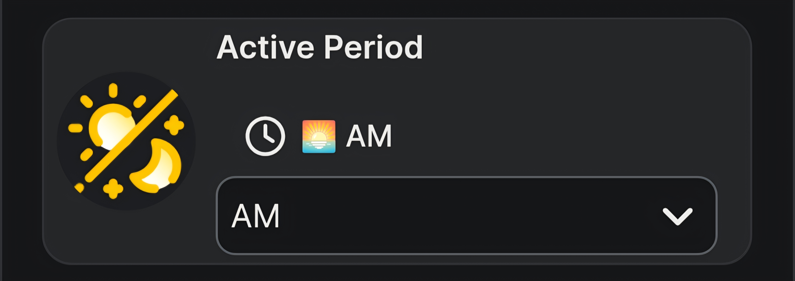
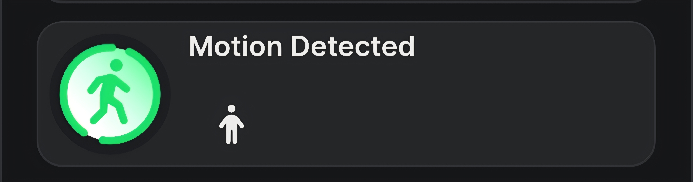
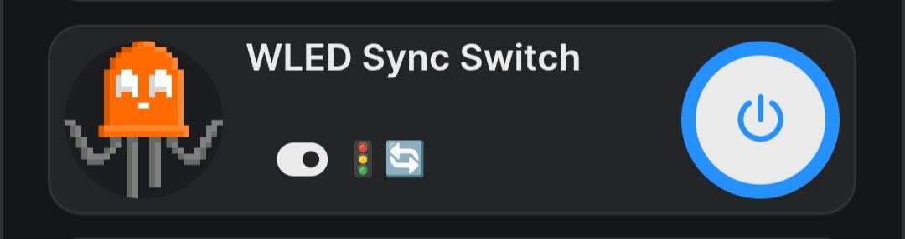
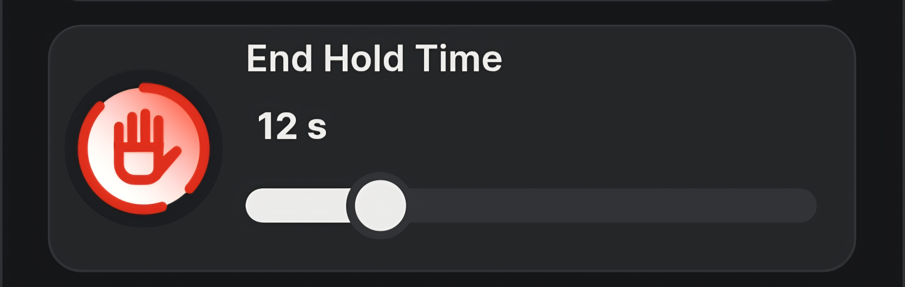
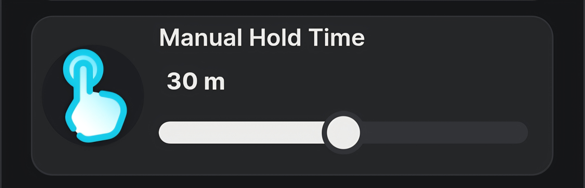
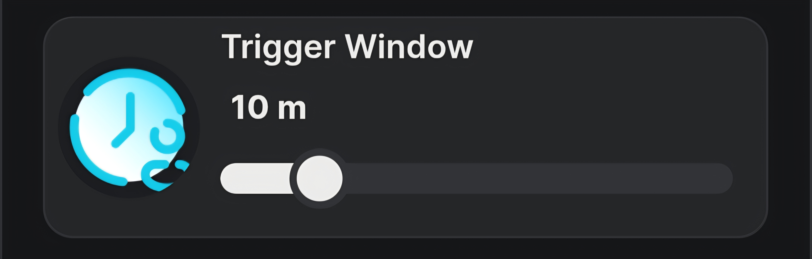

# ⚡ Advanced Motion Pro

### *Clockless adaptive motion lighting with multi-sensor input, WLED synchronisation, and schedule-driven scene intelligence — running fully on-device*

**Advanced Motion Pro** turns a Shelly dimmer and a pair of legacy motion sensors into a self-contained adaptive lighting engine. It replaces simple motion-on / motion-off behaviour with time-of-day scene selection, occupancy-scaled brightness escalation, synchronised WLED strip control, and a manual override system — all managed from a native Shelly virtual device card with no cloud, no Home Assistant, and no companion server.

Built by **SPARK_LABS** at **Recowatt Malta** — Official Shelly Distributor.

> **Entry:** Shelly Smart Home Challenge 2026 — Scripting & Logic Category

<div align="center">
  
</div>

<p align="center"><em>Advanced Motion Pro (centre) alongside GridMaster Pro ARMS (energy) and ZoneLight Fun (spatial WLED tracking) — three SPARK_LABS virtual appliances on the same network.</em></p>

---

## 📋 Table of Contents

1. [The Problem](#-the-problem)
2. [The Solution](#-the-solution)
3. [Hardware](#-hardware)
4. [System Architecture](#%EF%B8%8F-system-architecture)
5. [Adaptive Brightness Engine](#-adaptive-brightness-engine)
6. [Virtual Dashboard UI](#-virtual-dashboard-ui)
7. [Quick Start (Installer)](#-quick-start-installer)
8. [SITE_CONFIG Reference](#-siteconfig-reference)
9. [KVS Schema](#-kvs-schema)
10. [Companion Mode — ZoneLight Fun](#-companion-mode--zonelight-fun)
11. [Known Limitations](#-known-limitations)
12. [Repository Structure](#-repository-structure)
13. [License & Attribution](#-license--attribution)

---

## 🔧 The Problem

Native motion lighting on Shelly devices is binary — motion detected, light on; motion cleared, light off. There is no concept of time-of-day awareness, no brightness escalation based on corridor traffic, and no graceful hold period to prevent the light snapping off while you are still in the room.

Adding a WLED strip alongside the dimmer doubles the problem: two independent light sources with no synchronisation, no shared scene logic, and no unified control surface.

Handling time-of-day in a script introduces a third problem. Calling `new Date()` at runtime ties the logic to the device clock, which is unreliable before NTP sync completes and drifts on warm restarts. Most Shelly automation scripts either ignore the issue or build fragile clock-parsing routines.

---

## 💡 The Solution

Advanced Motion Pro solves all three problems with a single on-device script:

**Adaptive brightness** — instead of a fixed brightness, the engine escalates through configurable brightness steps based on how many motion triggers have occurred within a rolling time window. A quiet corridor at night gets 2%. A busy corridor during the day ramps to 60%.

**Unified dispatch gate** — both the dimmer and the WLED strip are driven through a single throttled command queue. Every scene change, manual adjustment, and motion event routes through the same gate, preventing race conditions and command floods on the embedded HTTP stack.

**Clockless schedule-driven periods** — instead of parsing `new Date()` at runtime, the Setup Wizard installs Shelly cron schedules that write directly to a virtual enum component via loopback RPC. The Brain simply reads the enum value to know whether it is AM, PM, or Night. The device's own scheduler handles all time logic — the script never touches a clock.

---

## 💻 Hardware

| Component | Role | IP (reference install) |
|-----------|------|------------------------|
| **Shelly Pro Dimmer 2PM** | Host device — runs the Brain, controls the ceiling pendant via `light:1` | `192.168.4.243` |
| **Shelly Motion Gen1** ×2 | PIR sensors at each end of the corridor — call the Brain's HTTP endpoints on motion start/end | `192.168.0.161`, `192.168.0.162` |
| **WLED controller** | Addressable LED strip — receives JSON API commands from the Brain for brightness and scene sync | `192.168.4.175` |

Any Shelly device with scripting, virtual components, and a dimmable output can host the Brain. The motion sensors can be any device capable of calling a URL on detection — Shelly Motion Gen1, Gen2, BLU Motion (via gateway actions), or third-party PIRs with HTTP webhook support.

---

## 🖥️ System Architecture

### Clockless Period Switching

This is the core architectural decision. Instead of building time-parsing logic into the Brain:

```
┌─────────────────────────────────────────────────────┐
│  Shelly Cron Scheduler (firmware-level)             │
│                                                     │
│  06:00 daily ──→ Enum.Set { id:200, value:"AM" }   │
│  17:00 daily ──→ Enum.Set { id:200, value:"PM" }   │
│  22:00 daily ──→ Enum.Set { id:200, value:"Night" } │
└─────────────────────────────────────────────────────┘
         │ loopback RPC
         ▼
┌─────────────────────────────────────────────────────┐
│  Brain reads enum:200 on every motion event         │
│  → selects the matching step matrix + defaults      │
│  → no Date(), no clock parsing, no NTP dependency   │
└─────────────────────────────────────────────────────┘
```

The Setup Wizard creates these schedules automatically. The schedule times and the period names are fully configurable in `SITE_CONFIG.schedules`.

### Event-Driven Motion Flow

```
Sensor detects motion
  → HTTP GET /script/{id}/motion?sensor=1
    → onMotionDetected("1")
      → push trigger timestamp into rolling window
      → compute adaptive scene from step matrix
      → queue dimmer + WLED commands via dispatch gate

All sensors clear
  → HTTP GET /script/{id}/motion_end?sensor=1
    → onMotionCleared("1")
      → 250ms debounce (wait for all sensors to confirm clear)
      → if ALL clear: start hold timer
      → hold expires: queue dimmer off + WLED off
```

### Multi-Sensor OR Logic

Multiple sensors share a single `ACTIVE_SENSORS` map. The light stays on as long as **any** sensor reports active. The hold timer only starts when **all** sensors have cleared — preventing the corridor light from blinking off when one sensor resets while the other is still tracking.

### Throttled Dispatch Queue

All outbound commands (dimmer HTTP, WLED JSON POST) pass through a single-slot queue with a 250ms cooldown between calls. This prevents the embedded HTTP client from choking under rapid motion events and ensures dimmer + WLED commands execute in strict order.

### WLED Brightness Sync Loop

When WLED sync is enabled, the Brain polls the dimmer's current brightness every 2 seconds and mirrors it to the WLED strip. This keeps both light sources aligned during manual slider adjustments in the Shelly app — not just during motion events.

---

## 📈 Adaptive Brightness Engine

Each time period (AM, PM, Night) has its own **step matrix** — a flat array of trigger thresholds and brightness values:

```javascript
// Format: [triggers, dimBri, wledBri, triggers, dimBri, wledBri, ...]
const STEPS_AM = [1, 20, 20, 3, 40, 40, 6, 60, 60];
const STEPS_PM = [1, 15, 15, 5, 30, 20, 10, 40, 40];
const STEPS_NT = [1, 2, 2,  3, 20, 3,  6, 10, 10];
```

Reading `STEPS_AM`: after 1 trigger → 20% dimmer, 20% WLED. After 3 triggers → 40/40. After 6 triggers → 60/60.

The flat positional format avoids nested objects — saving memory on the shared mJS heap. Triggers are counted within a configurable rolling time window (default: 10 minutes). When traffic drops below a threshold, the next motion event maps back to the lower brightness step.

Each period also carries **default values** (used before the first trigger threshold is reached) and independent **transition times** for smooth fading:

```javascript
const DEFAULTS = {
    am: { d_b: 20, w_b: 20, d_t: 5000, w_t: 2500 },
    pm: { d_b: 15, w_b: 15, d_t: 6000, w_t: 3000 },
    nt: { d_b: 2,  w_b: 2,  d_t: 12000, w_t: 6000, ad_dis: false }
};
```

Night mode supports an `ad_dis` flag that disables adaptive escalation entirely — locking the brightness to the default regardless of trigger count. Useful for corridors where any light above minimum is disruptive at night.

---

## 📊 Virtual Dashboard UI

The application builds **9 virtual components** under a single control card, configurable from the Shelly Smart Control app:

<!-- PLACEHOLDER: Replace with actual VC screenshots when available -->

| # | UI Component | Type | Direction | Function |
|---|---|---|---|---|
| 1 | **Active Period**  | Dropdown | Cron → Brain | Current time period: 🌅 AM, 🌇 PM, 🌙 Night. Written by Shelly's cron scheduler via loopback — not by the user. |
| 2 | **System Status**  | Label | Brain → UI | Live ticker: `🟢 AM | 7 trigs | 60%` or `⏳ HOLDING | 12s` or `🛑 MANUAL HOLD`. |
| 3 | **Current Activity**  | Label | Brain → UI | Rolling trigger count within the active time window. |
| 4 | **Motion Detected**  | Label | Brain → UI | Live motion indicator — true while any sensor is active. |
| 5 | **Motion Logic Switch**  | Toggle | User ↔ Brain | Enables/disables motion-driven lighting without stopping the script. |
| 6 | **WLED Sync Switch**  | Toggle | User ↔ Brain | Enables/disables WLED strip synchronisation independently. |
| 7 | **End Hold Time**  | Slider | User ↔ Brain | Grace period (0–60s) after all sensors clear before lights turn off. |
| 8 | **Manual Hold Time**  | Slider | User ↔ Brain | Duration (0–60m) of the manual override lock triggered by a double-press. |
| 9 | **Trigger Window**  | Slider | User ↔ Brain | Rolling window (1–60m) for counting motion triggers toward brightness escalation. |

**Group order** in the Shelly app matches the numbered list above — Active Period at top, Trigger Window at bottom.

### Status Ticker Format

The `text:200` status line cycles between three states:

| State | Display | Meaning |
|---|---|---|
| Active | `🟢 AM | 7 trigs | 60%` | Period, trigger count, current dimmer brightness |
| Holding | `⏳ HOLDING | 12s` | All sensors clear, grace period countdown active |
| Manual | `🛑 MANUAL HOLD` | Manual override active — motion logic suspended |
| Clear | `CLEAR` | No recent activity, lights off |

---

## 🛠️ Quick Start (Installer)

Deployment uses a Setup Wizard (run once) and a Brain (run on startup).

### Phase 1 — Sensor Preparation

Configure each motion sensor to call HTTP URLs on detection start and end. The Brain registers two endpoints:

```
Motion start:  http://<DEVICE_IP>/script/<SCRIPT_ID>/motion?sensor=<ID>
Motion end:    http://<DEVICE_IP>/script/<SCRIPT_ID>/motion_end?sensor=<ID>
```

For Shelly Motion Gen1/Gen2, paste these into the sensor's I/O URL Actions. For BLU Motion, create gateway actions on the host device. The `sensor` parameter is a unique string ID per sensor — it does not need to match hardware IDs.

### Phase 2 — The Setup Wizard

1. Save `Advanced_Motion_Pro_Setup.js` to an empty script slot on the host device.
2. Edit `SITE_CONFIG` — set your dimmer output ID, WLED IP, sensor URLs, schedule times, and step matrices.
3. Review the operation toggles at the top of the script:

| Toggle | Default | Effect |
|--------|---------|--------|
| `DELETE_VCS` | `true` | Wipe conflicting components before install |
| `DELETE_KVS` | `false` | Keep safe unless structural reset needed |
| `SET_KVS` | `true` | Seed configuration into KVS |
| `CREATE_VCS` | `true` | Build all 9 virtual components + group |
| `SET_SCHEDULES` | `true` | Create the AM/PM/Night cron schedules |

4. Run the script. Watch the console for `✅ ALL SYSTEM COMPONENTS & SCHEDULES FULLY PROVISIONED`.
5. Disable or delete the Setup Wizard.

### Phase 3 — The Brain

1. Save `Advanced_Motion_Pro_Brain.js` into a permanent script slot.
2. Tick **Run on Startup** and start the script.
3. Verify the console shows `[AM-PRO] ONLINE · Version 1.5`.
4. Test by triggering a sensor — confirm the dimmer responds and the status ticker updates.

### Phase 4 — Virtual Device Card (Optional)

1. Open the device in the Shelly Smart Control app.
2. Navigate to the **Advanced Motion Control** group.
3. Tap Settings → **Extract virtual group as device** (requires Shelly Premium).
4. Reorder small parameters for optimal card display.

---

## ⚙️ SITE_CONFIG Reference

| Key | Type | Default | Description |
|-----|------|---------|-------------|
| `l_id` | number | `1` | Hardware light output ID on the host dimmer |
| `wled.en` | boolean | `true` | Enable/disable WLED integration entirely |
| `wled.ip` | string | — | WLED controller IP address |
| `wled.ps` | number | `22` | WLED preset ID to activate on motion (0 = disabled) |
| `wled.pl` | number | `0` | WLED playlist ID (takes priority over preset) |
| `wled.fx` | number | `0` | WLED effect ID (used if preset and playlist are both 0) |
| `wled.cct` | number | `0` | WLED CCT value for solid-colour fallback (127 = warm white) |
| `hold_s` | number | `12` | End-hold grace period in seconds |
| `m_hold_s` | number | `1800` | Manual hold duration in seconds (30 minutes) |
| `poll_ms` | number | `2000` | WLED sync loop polling interval |
| `trans.on` | number | `300` | Dimmer fade-in transition (ms) |
| `trans.off` | number | `1500` | Dimmer fade-out transition (ms) |
| `debug` | boolean | `true` | Enable verbose console logging |
| `sensors[]` | array | — | Sensor list: `{ id: "1", url: "http://..." }` per sensor |
| `schedules[]` | array | — | Cron definitions: `{ name, timespec, period }` per period |

### WLED Scene Priority

On motion, the Brain applies the first non-zero option in this order:

1. **Playlist** (`wled.pl`) — cycles through multiple presets
2. **Preset** (`wled.ps`) — loads a saved WLED state
3. **Effect** (`wled.fx`) — activates a WLED animation
4. **Solid CCT** (`wled.cct`) — falls back to a solid colour temperature

Set all to `0` except the one you want. On non-motion sync events (manual slider adjustments), only brightness is mirrored — the scene is not re-applied.

---

## 🗄️ KVS Schema

All configuration is stored in device KVS and loaded by the Brain on boot. No runtime KVS writes — all state lives in RAM.

| Key | Contents | Size |
|-----|----------|------|
| `am_config` | Core config blob (dimmer ID, WLED settings, hold times, transitions, debug flag) | ~200 bytes |
| `am_sensors` | Sensor array `[{id, url}, ...]` | ~100 bytes |
| `am_steps_am` | AM step matrix `[triggers, dimBri, wledBri, ...]` | ~30 bytes |
| `am_steps_pm` | PM step matrix | ~30 bytes |
| `am_steps_nt` | Night step matrix | ~30 bytes |
| `am_defaults` | Default brightness/transition per period | ~120 bytes |
| `am_schedules` | Schedule name tracking array | ~40 bytes |
| `am_schema` | Installer version string | ~5 bytes |

The split-key design keeps each KVS value well under the mJS JSON parse limit. A single monolithic config blob would risk parse failures on memory-constrained devices.

---

## 🤝 Companion Mode — ZoneLight Fun

Advanced Motion Pro is designed to operate standalone **or** as a companion to **ZoneLight Fun** — a spatial zone-tracking controller running on a Shelly Presence Gen4 sensor.

When ZoneLight Fun's `override` flag is `true`, it assumes authority over the corridor's WLED zones and delegates electrical dimmer control to Advanced Motion Pro via HTTP callbacks:

```
Occupant enters corridor → ZoneLight calls /motion?sensor=zonelight
Corridor fully clears    → ZoneLight calls /motion_end?sensor=zonelight
```

Advanced Motion Pro treats `"zonelight"` as just another sensor in its OR matrix — the same hold logic, adaptive brightness, and period selection apply. The division of labour: ZoneLight handles per-zone WLED pixel overlays; Advanced Motion Pro handles time-of-day scene rules and the electrical dimmer.

---

## ⚠️ Known Limitations

* **Sensor reachability.** The Brain polls each sensor URL on boot to check for pre-existing motion. If a sensor is unreachable at boot, its initial state defaults to clear — a person already in the corridor may not be detected until they move again.

* **No persistent trigger count.** The rolling trigger window and count live in RAM. A script restart resets the count to zero and the brightness to the period default. This is by design — window timers cannot survive a restart.

* **Clock dependency on cron.** The clockless design moves time logic to the Shelly firmware scheduler, which itself depends on NTP. If the device has not synced its clock (e.g. after a power outage with no internet), schedules may fire at incorrect times until NTP completes.

* **WLED sync is one-directional.** The Brain mirrors dimmer brightness to WLED, but changes made directly on the WLED web UI are not read back. The WLED strip may drift out of sync if controlled externally.

* **Single dimmer output.** The current architecture controls one `light:N` output. Multi-channel dimming (e.g. separate corridor zones on a Dimmer 2PM) would require duplicating the dispatch logic per channel.

---

## 📂 Repository Structure

```
Shelly_Advanced_Motion_Pro/
├── Advanced_Motion_Pro_Brain.js        # Runtime engine — v1.5
├── Advanced_Motion_Pro_Setup.js        # Setup Wizard / installer — v1.6
├── README.md
└── assets/
    ├── UIx3.jpg                        # Hero — three SPARK_LABS panels side-by-side
    ├── AM_VC_PERIOD.jpg                # VC — active period dropdown
    ├── AM_VC_STATUS.jpg                # VC — system status ticker
    ├── AM_VC_ACTIVITY.jpg              # VC — current activity count
    ├── AM_VC_MOTION.jpg                # VC — motion detected indicator
    ├── AM_VC_LOGIC.jpg                 # VC — motion logic toggle
    ├── AM_VC_WLED.jpg                  # VC — WLED sync toggle
    ├── AM_VC_HOLD.jpg                  # VC — end hold time slider
    ├── AM_VC_MANUAL.jpg                # VC — manual hold time slider
    └── AM_VC_WINDOW.jpg                # VC — trigger window slider
```

---

## ⚖️ License & Attribution

Developed by **SPARK_LABS** at **Recowatt Malta** — Official Shelly Distributor.

### Acknowledgements

* **[Shelly](https://www.shelly.com/)** — for the hardware platform, the mJS scripting engine, the cron scheduler, and the virtual-component framework that makes on-device UI possible.
* **[Shelly Academy](https://academy.shelly.com/)** — for the scripting courses, API walkthroughs, and worked examples that informed the architectural patterns used throughout SPARK_LABS projects.
* **Icons** — UI component icons sourced from [Icons8](https://icons8.com) (`https://img.icons8.com`). WLED icon from [Homarr Dashboard Icons](https://github.com/homarr-labs/dashboard-icons) (`cdn.jsdelivr.net/gh/homarr-labs/dashboard-icons`).

---

**⚡ SPARK_LABS** — **S**helly **P**owered **A**utomation **R**eliable **K**ontrol

Technician, Installer & Shelly Academy Graduate at [Recowatt Malta](https://recowatt.com)

[github.com/Nc-eW22](https://github.com/Nc-eW22)

*Turning everyday Shelly devices into truly smart virtual appliances.*
